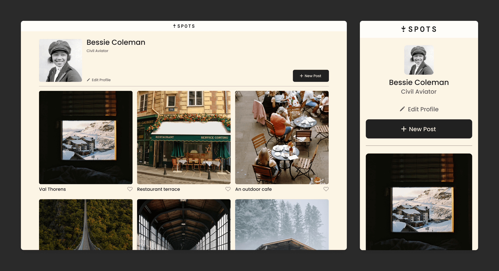

# Spots

This project is an interactive social media web application. Created using HTML and CSS, as well as Figma for the design layout.

## Project features

- HTML
- CSS
- Images
- Flexbox
- Media Queries
- Resposive Design
- Flat BEM file structure

**Preview**

**Deployed to GitHub Pages**

- [Link to this project](https://adriana-vargas3.github.io/se_project_spots/)
